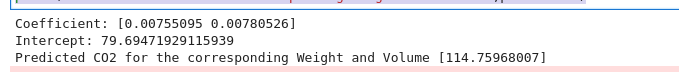

# Implementation of Multivariate Linear Regression
## Aim
To write a python program to implement multivariate linear regression and predict the output.
## Equipment’s required:
1.	Hardware – PCs
2.	Anaconda – Python 3.7 Installation / Moodle-Code Runner
## Algorithm:
### Step1 : 
Import panda

### Step2 : 
Import linear model from sklearn

### Step3: 
Read the file cars.csv

### Step4: 
Assign the values for x and y as required

### Step5: 
Create the linearRegression model and predict the output

## Program:
``` PYTHON
#Program for Multivariate linear regression using the least squares method.
#Developed by: SASI RAJ KUMAR TJ
#RegisterNumber: 22005240
import pandas as pd
from sklearn import linear_model
data=pd.read_csv("cars.csv")
X=data[['Weight','Volume']]
Y=data['CO2']
regr=linear_model.LinearRegression()
regr.fit(X,Y)
print('Coefficient:',regr.coef_)
print('Intercept:',regr.intercept_)
predictCO2=regr.predict([[3300,1300]])
print('Predicted CO2 for the corresponding Weight and Volume',predictCO2)

```
## Output:
### INSERT YOUR OUTPUT

## Result
Thus the multivariate linear regression is implemented and predicted the output using python program.
